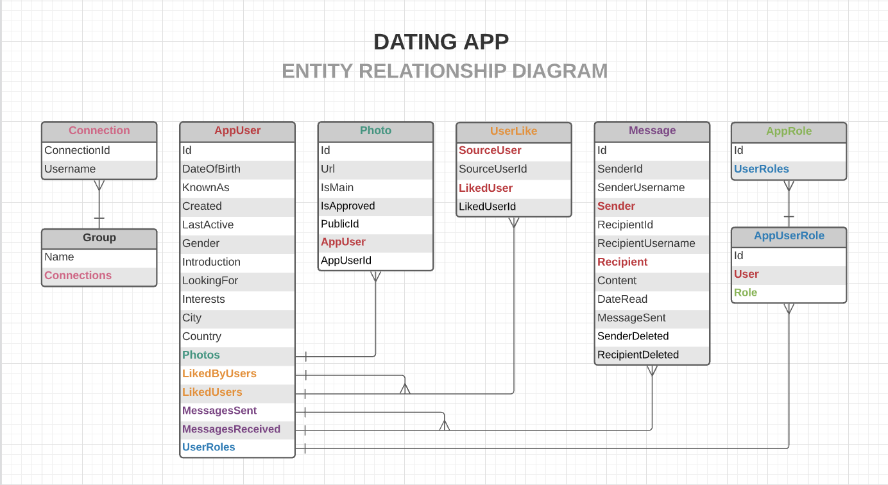
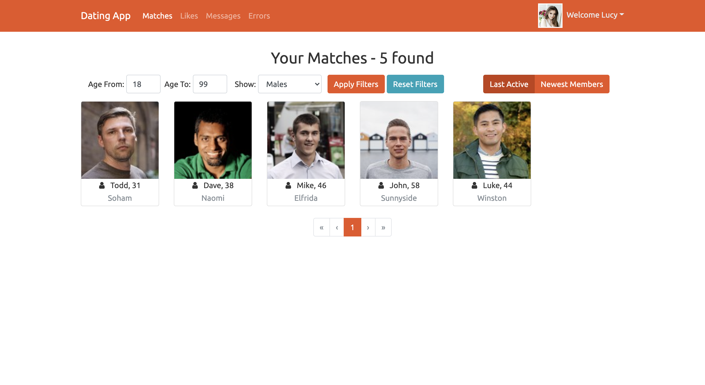
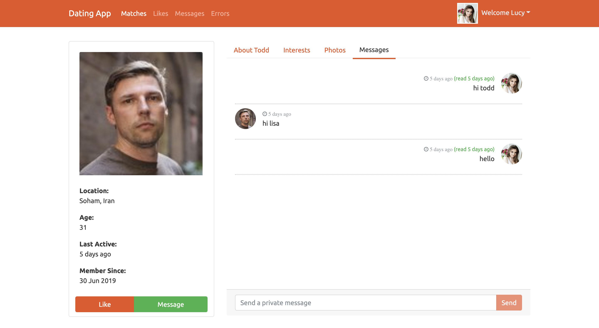
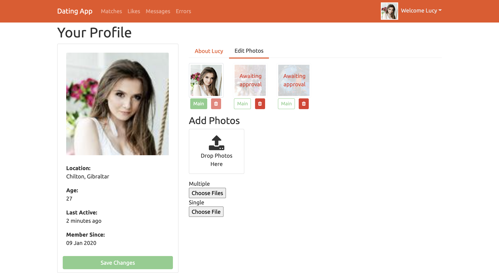
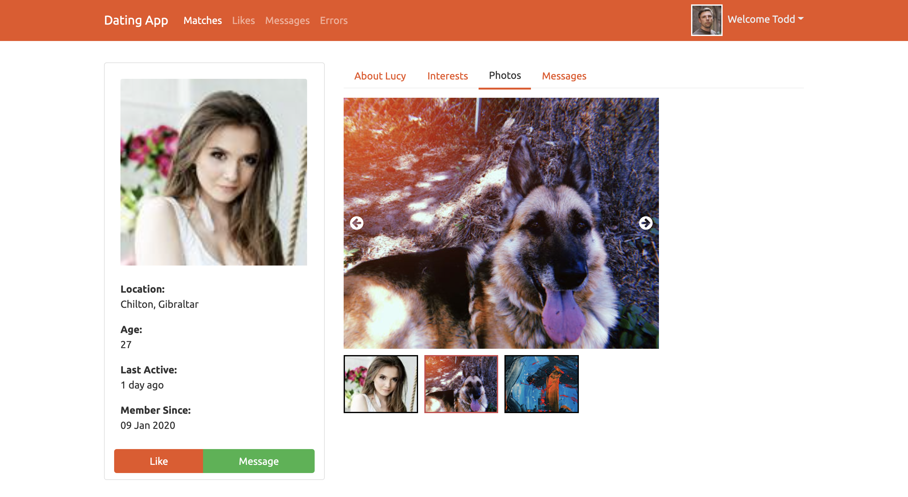
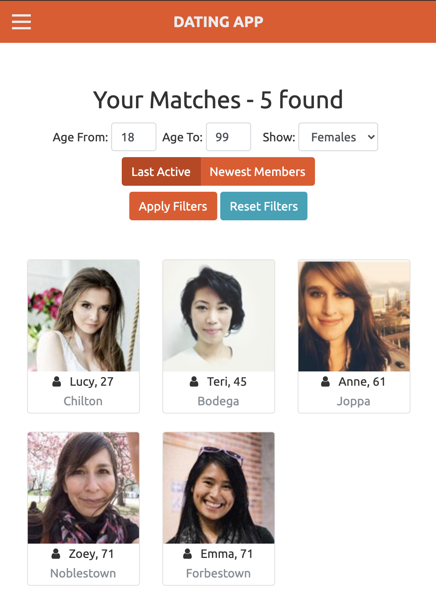
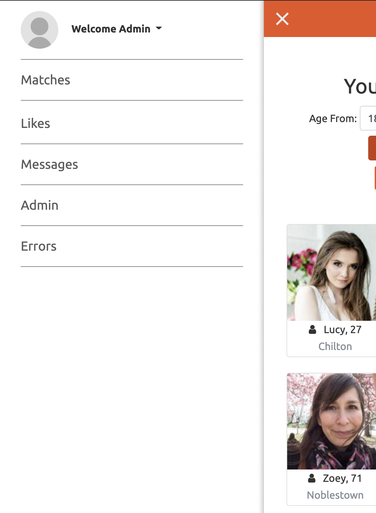

# Dating app 

# Visit Live Site >> https://dating-app-proj.herokuapp.com/

## Description
- This dating app allows users to...
    - filter and view other members of the app. 
    - Users may like other users and view who has liked them. 
    - message one another, and receive live notifications of new messages. 
    - Presence tracking will mark a messages date read and sent as well as indicate other users online. 
    - Users may upload photos to their gallery and set a profile picture, after being approved my a moderator or admin. 

## Languages
- **.Net**
- **Angular**
- **Entity Framework**
- C#
- Typescript
- HTML5
- CSS
- Bootstrap
- other [tools and resources](tools-rescources.md)

## About app
- Client 
    - **Angular Typescript Client**
    - JWT authentication and validation
    - Asp.Net identity & roles
    - Filter caching
    - Angular routing
    - Error handling and client testing
    - Custom Directives
    - Live notification service
- API 
    - **Asp.Net C# API**
    - PostgreSQL database
    - Pagination & Filtered Queries
    - entity relationships
        - one to many - Photos
        - many to many - Likes / Roles
    - Photo upload - Cloudinary.com
    - SignalR Messaging
    - Presence Tracking 
## Entity Relationship Diagram
<table><tr><td>
    
</td></tr></table>

## App Preview

    <table>
        <tr>
            <td>
                
            </td>
            <td>
                
            </td>
        </tr>
        <tr>
            <td>    
                
            </td>
            <td>
                
            </td>
        </tr>
        <tr>
            <td>    
                 
            </td>
            <td>
                
            </td>
        </tr>
    </table>

