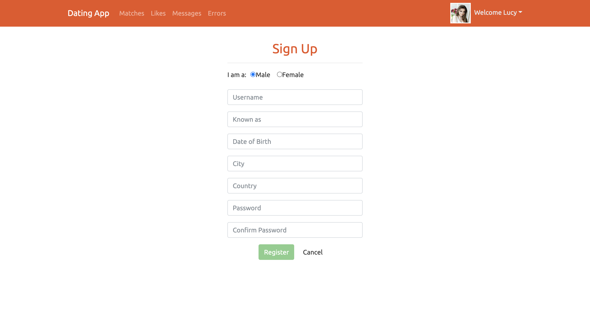
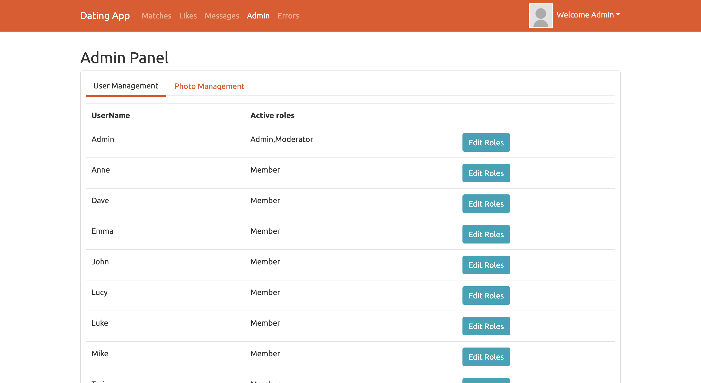
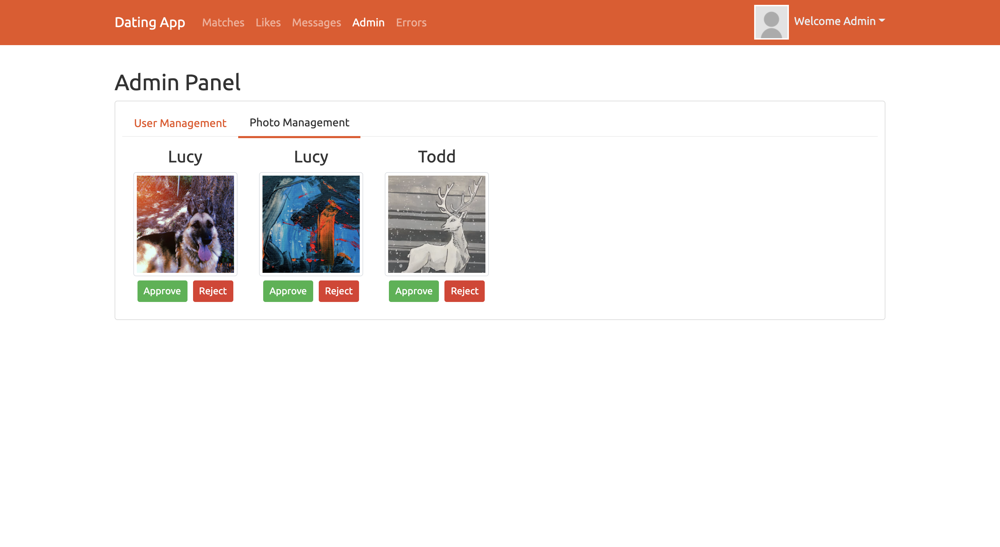
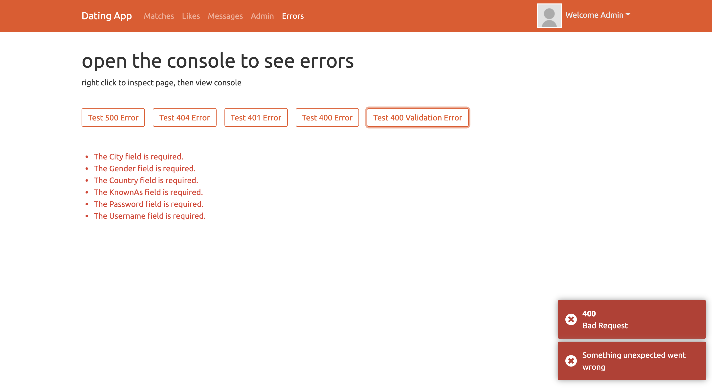

# Dating app 

# Visit Live Site >> https://dating-app-proj.herokuapp.com/

## Description
### <i class="fas fa-puzzle-piece" aria-hidden="true"></i> Puzzle Icon
{: #puzzle}
- This dating app allows users to...
    - <i class="fas fa-eye"></i> filter and view other members of the app. 
    - <i class="fas fa-heart"></i> Users may like other users and view who has liked them. 
    - <i class="fas fa-comments"></i> message one another, and receive live notifications of new messages. 
    - <i class="fas fa-portrait"></i> Presence tracking will mark a messages date read as well as indicate other users who are online. 
    - <i class="fas fa-comments"></i> Users may also upload photos to their gallery and set a profile picture, after being approved my a moderator or admin. 

## Languages
- ### **.Net**
- ### **Angular**
- ### **Entity Framework**
- C#
- Typescript
- HTML5
- CSS
- Bootstrap

- other [tools and resources](tools-rescources.md)

## About app
- Client 
    - **Angular Typescript Client**
    - JWT authentication and validation
    - Asp.Net identity & roles
    - Filter caching
    - Angular routing
    - Error handling and client testing
    - Custom Directives
    - Live notification service
- API 
    - **Asp.Net c# API**
    - PostgreSQL database
    - Pagination & Filtered Queries
    - entity relationships
        - one to many - Photos
        - many to many - Likes / Roles
    - Photo upload - Cloudinary.com
    - SignalR Messaging
    - Presence Tracking 

## Preview

    
    
    
    
    
    
    
    

