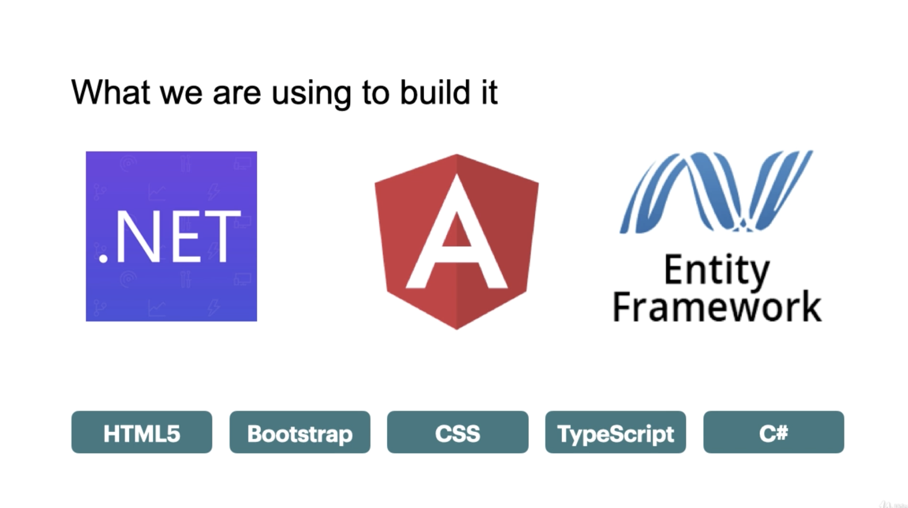

# Dating app 

# ======= SECTION 1 =======
### API project
- walking skeleton 
    - put data in database
    - make api to get data
    - make angular app to query api and get data
    - display in browser

- learning goals
    - use dotnet cli
    - api controllers and endpoints
    - entity framework
    - api project structure
    - config and env variables
    - source control (github)

### set up & run application
- check if dotnet sdk is installed
    - `> $ dotnet --info `
- template : ASP.NET Core Web API 
    - `dotnet new sln`
    - `dotnet new webapi -o API`
    - add project into solution
    - `dotnet sln add API`

- extensions
    - c# by omnisharp
    - c# extensions by joskreativ
    - autosave

- get to project folder
    - `cd API`
- build application (http & https)
    - `dotnet run`
- trust cetificate for sdk (https)
    - cancel server
    - `dotnet dev-certs https --trust`
    - `dotnet run`
    - 5001 cant be found (api project)
        - look at controller: json shows for localhost:5001/weatherforecast (default from template)
    - controller end point (httpGet)

- **appsettings.Development.json**
    - change "Microsoft" log level from warning to information

- **Stratup.cs** 
    - configure services "dependency injection" - give other parts of application acess

- **properties/launchsettings.json**
    - `"launchBrowser": false,`

- `dotnet watch run` shows file changes

### adding entity framework to project

- creating entity
    - add get set properties to **Entities/AppUser.cs**

- entity framework
    - ORM object relational mapper
    - translates SQL commands to update tables in database
    - features
        - querying
        - change tracking
        - saving (db)
        - concurrency (others usin gdb)
        - transactions
        - caching
        - built in conventions 
        - migrations (schema)

- add extensions
    - nuget gallery by pcislo
        - install Microsoft.EntityFrameworkCore.Sqlite by Microsoft
        - adds < package reference > in API.csproj

- add data/datacontext.cs
    - create constructor
    
- add AddDbContext in ConfugureServices in Startup.cs
    - appsettings.development.json 
        - sql lite connection string ok to be public in files.
        - name of file to store database - "Data source=datingapp.db"
    
- install notnet-ef
- `dotnet tool install --global dotnet-ef --version 5.0.1`
- `dotnet ef migrations add InitailCreate -o Data/Migrations`
- error for Microsoft.EntityFrameworkCore.Design
- run again added migrations file
    - **initial create .cs**
    - create table called users
        - two columsn
            - id - integer primary/auto increment
            - username

## create database
- stop api runnung 
- `dotnet ef database update`

- sql extension SQLite by alexcvzz
- command shift p 
    - use sql lite open database
    - sqlite explorer pannel view
    - right click on users
        - new query insert
        - write queries
            - highlight adn right click, run queries
            - rightclick users, show table

## finsihing walking skeleton
-  adding new controller
    - add endpoints - users & user
- making code asynchronus & scalable
    - async Task & await
- saving changes into source control
    - use github

# ========= SECTION 2 =========
- learning goals
    - use angular cli
    - how to create angular app
    - algular project files
    - angular bootstrap process
    - using angular http client service
    - run angular app over https
    - add packages with npm
        - font awesom e
        - bootstrap

## create angular app client (angular cli)
- inside datingapp dir
- `npm install -g @angular/cli@7.1.0`
- `ng new client --skip-tests --style=css`
    - yes strict (should have said no)
    - yes angular routing
- cd client
- `ng serve`

- contents
    - angular apps are single page
    - <app-root> class
    - typescript decorator (@Component) - normal class can be used as componenet

- interpilation : give data from component to template view
    - set variable in comp and use with double braces {{}}

## vs code extensions to use angular
- angular language service by angular
- angular snippets by john papa
- bracket pair colorizer 2 by conraadS

## HTTP requests in angular component
- add angular module **app.module.ts**
    - imports :[ HttpClientModule ]

- http naturally async req 
    - angular component constructor too early for async req
    - use initilization lifecycle

- typescript gives typesafety unless you use `any` as user property;
- observable : how Typescript handles asynchronus code
- subscribe : 

## adding cors in API
- cross origin rescource sharing
